原文地址：https://help.eclipse.org/2021-03/index.jsp?topic=%2Forg.eclipse.mat.ui.help%2Fconcepts%2Fheapdump.html    
Getting Started > Basic Tutorial

如果你不是使用的独立的Mat而是使用的Eclipse中安装的mat插件，你可以通过 `Window > Perspective > Open Perspective > Other ... > Memory Analysis`打开mat的分析功能

#### 1.获取堆的dump文件
Mat主要用来分析堆文件。堆文件包含那一刻中java所有对象的信息，这里不说明如何dump一个堆文件

#### 2.检查堆文件的Overview信息
通过 `File->Open Heap Dump` 打开堆文件，就可以看到堆文件的总览    
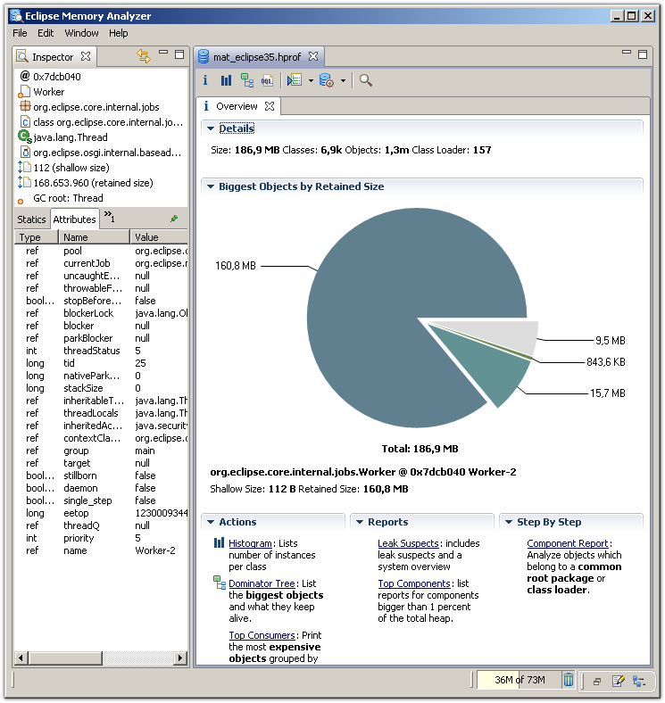

在图中的右侧，可以看到堆的大小，类、对象以及class loader的数量。    
如果上图中显示的堆的大小远远小于dump文件的大小，有可能堆中包含了许多垃圾对象，这些对象在下一次垃圾回收时会被回收。
可以通过查看<a href="">不可达对象（unreachable objects）</a>查询来检查这些垃圾对象.

右下方的饼图展示了堆中最大的对象占比。 将鼠标移到饼图切片上，在左侧的对象检查器中查看对象的详细信息。 单击饼图上的任何切片可以查看更多内容，可以跟踪例如传出的引用（outgoing references）等信息。

#### 3.获取直方图
选择工具条的直方图图标，展示每个类的实例数量，<a href="">shallow size </a>和 <a>retained size</a>        
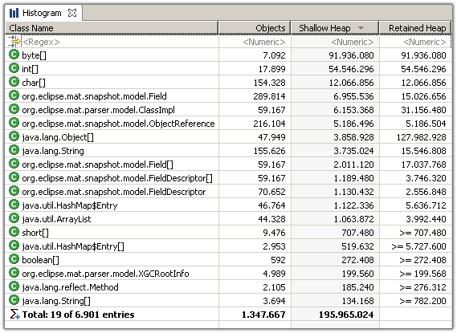

默认情况下，mat会显示单个对象的保留大小（retained size）。 但是，一组对象的保留大小（这种情况下为特定类的所有实例）则需要计算。    
为了估算直方图中所有展示行的保留大小，可以点击工具栏的计算器图标。同样，也可以选定一些行然后使用上下文菜单来计算保留大小    
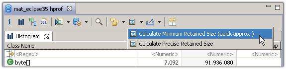    

使用上下文菜单，你可以针对选定的行的对象进行深入的分析（drill-down）。比如，你可以列举这些对象的outgoing引用(当前对象所引用的外部对象)和incoming引用（当前对象被哪些外部对象引用）。
或按属性值将对象分组。 或按集合大小对集合进行分组。等等    
Mat如此强大的一个点是你可以在任何对象集上做任何分析,只需要点击这些对象，然后选择上下文菜单里的功能来进行分析。    
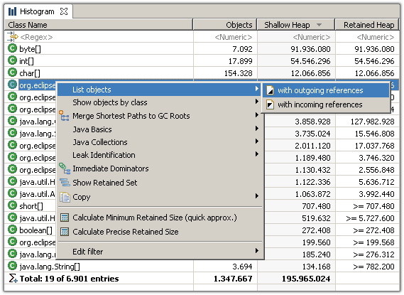    

另一个重要的特性是你可以根据class loader、包名或者父类来对任何的直方图进行分组    
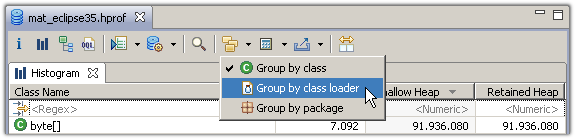    
任何普遍的应用程序都是由不同的类加载器来加载不同的组件。Mat会在类加载器上附加一个有意义的标签——对于OSGi服务，是对应的Bundle id。因此可以很容易将
堆文件分成更小的模块。    
更多参考：<a href="">分析Class Loader（Analyze Class Loader）<a/>    
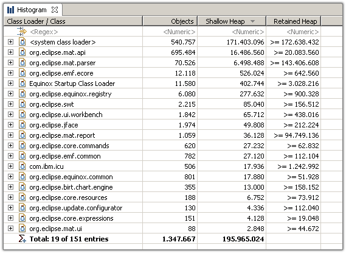  

将直方图根据包来分组可以沿Java包层次结构进行深入分析    
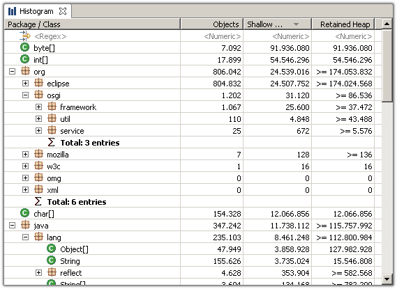 

通过父类对直方图进行分组提供了一种简单的方法，例如可以找到`java.util.AbstractMap`的所有子类
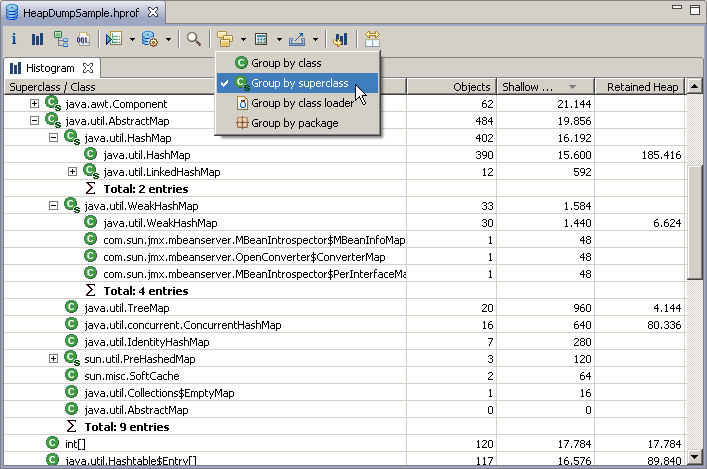

#### 4.查看支配树（Dominator Tree）
<a href="">支配树（Dominator Tree）</a>展示了堆中最大的对象。树的下一层列出了如果删除了所有对父节点的传入引用（incoming reference），将被垃圾回收的那些对象。    
支配树是研究哪些对象使其他对象保持活动状态的强大工具。 同样，可以通过类加载器和包对树进行分组，以简化分析  
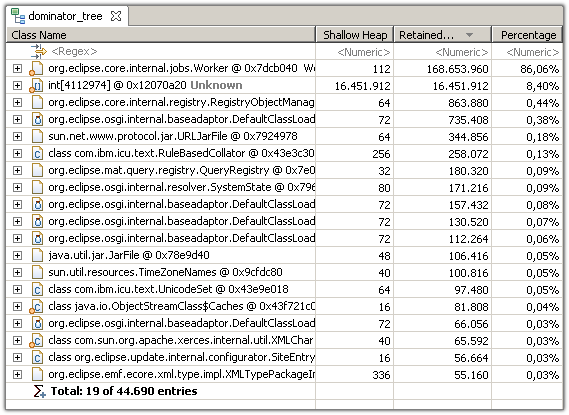

#### 5. GC Root 路径
<a>垃圾收集根（GC Roots）</a>是指JVM本身保持活动的对象。这些包括例如当前正在运行的线程的线程对象，当前在调用堆栈上的对象以及由系统类加载器加载的类。    
从对象到GC根的（反向）引用链-即GC Root路径-解释了为什么这些对象无法被回收。 该路径有助于解决Java中的经典内存泄漏：之所以存在这些泄漏，是因为即使程序逻辑将不再访问该对象，这些对象仍然被引用（即有路径到GC Roots）。    
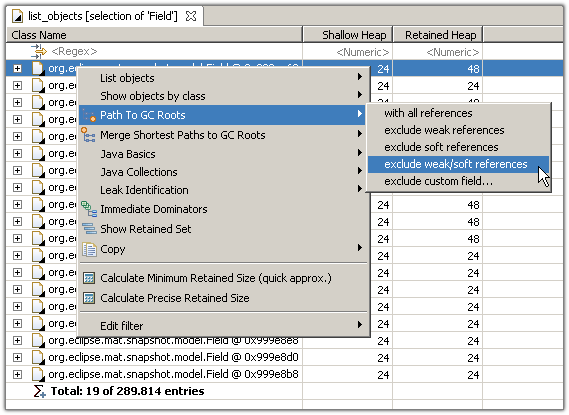    
最开始会选择到达GC Root根的最短路径  
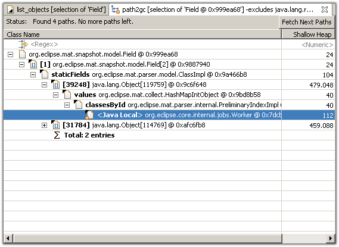  

#### 6.生成内存泄露报告
Mat可以检查堆文件中是否存在泄漏可疑对象，例如 一个或一组可疑的大对象。  
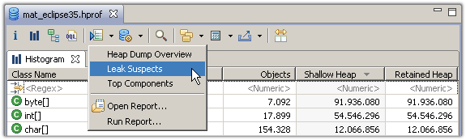     
更多内存泄漏报告可以查看：博客<a href="https://memoryanalyzer.blogspot.com/2008/05/automated-heap-dump-analysis-finding.html">Automated Heap Dump Analysis: Finding Memory Leaks with One Click </a>
或者 <a href="">运行内存泄漏检查报告</a>

